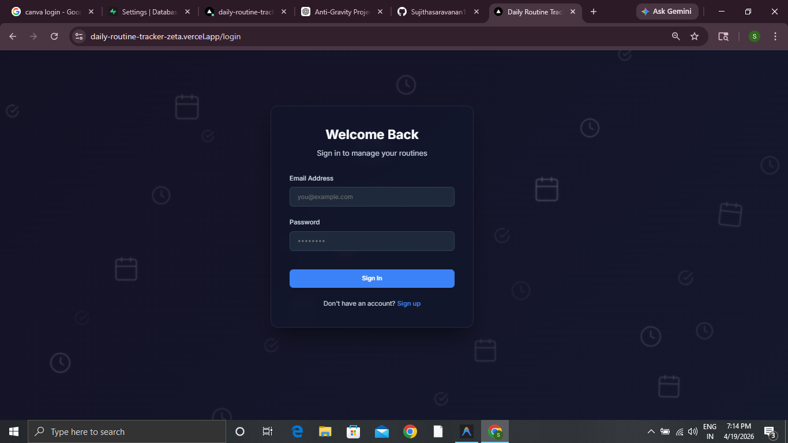
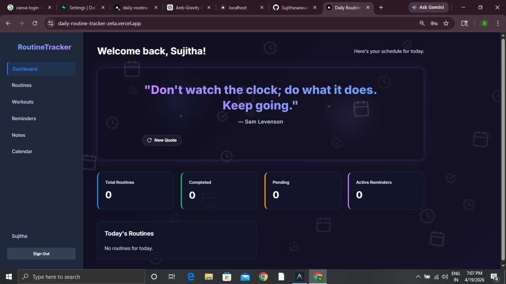
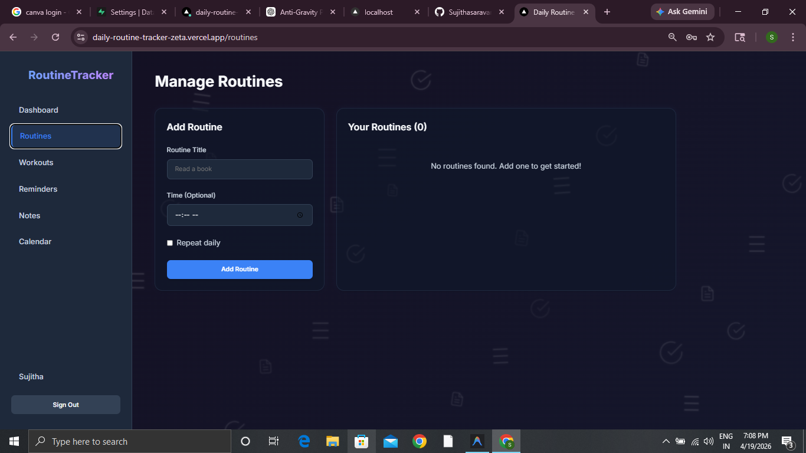
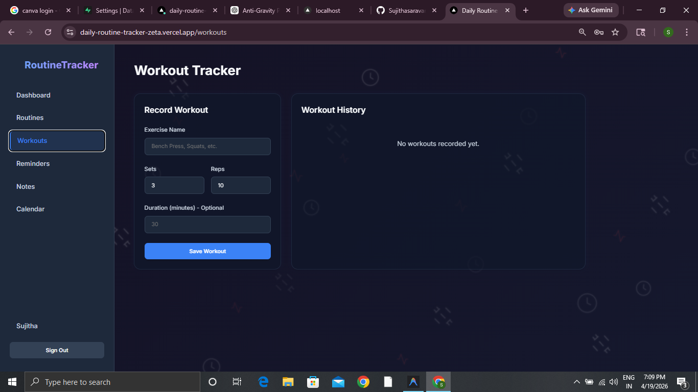
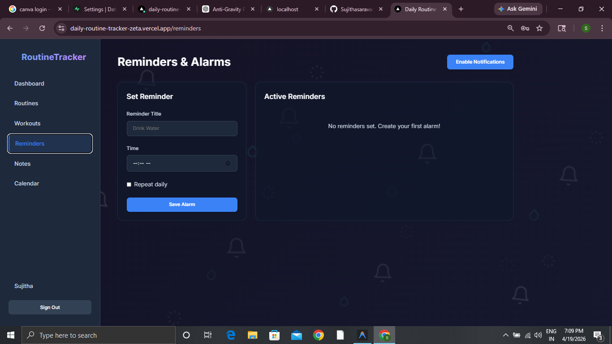

## 🌐 Live Demo

👉 https://daily-routine-tracker.vercel.app
fix deploy 

# 🚀 Daily Routine Tracker

A modern full-stack productivity web application designed to help users manage their daily routines, workouts, reminders, and personal tasks — all in one place with a premium and interactive UI.

---

## ✨ Features

- 🔐 User Authentication (Login / Signup)
- 📅 Daily Routine Tracking
- 🏋️ Workout Management System
- ⏰ Reminder System with Notifications
- 💭 Dynamic Motivational Quotes
- 🔥 Streak Tracking System
- 📝 Notes Management
- 📊 Basic Analytics (Task Completion & Activity)
- 🎨 Animated Background UI
- 🧊 Glassmorphism Design
- 🌀 3D Interactive UI Effects

---

## 🛠️ Tech Stack

- **Frontend:** Next.js, React  
- **Backend:** Next.js API Routes  
- **Database:** Prisma ORM with SQLite (Development)  
- **Styling:** Custom CSS (Glassmorphism + Animations)  
- **Deployment:** Vercel (Recommended)  

---

## 🎯 Key Highlights

- 💎 Premium SaaS-style UI design  
- ⚡ Smooth animations and transitions  
- 📱 Fully responsive layout  
- 🔄 Real-time UI updates  
- 🧠 Clean and scalable code structure  
- 🔧 Full-stack implementation (Frontend + Backend + Database)  

---

## 🚀 Getting Started

### 1️⃣ Clone the repository

```bash
git clone https://github.com/Sujithasaravanan1111/DailyRoutineTracker.git
cd DailyRoutineTracker

2️⃣ Install dependencies
npm install

3️⃣ Setup database
npx prisma generate
npx prisma migrate dev

4️⃣ Run the development server
npm run dev

5️⃣ Open in browser

👉 http://localhost:3000

## 📸 Screenshots Gallery

### 🔐 Authentication & Access
| Login Page | Signup Page |
|------------|-------------|
|  |  |

### 📊 Main Features
| Dashboard | Manage Routines |
|-----------|------------------|
|  |  |

### 🏋️ Tracking & Alerts
| Workout Tracker | Reminders & Alarms |
|-----------------|--------------------|
|  |  |

---
💡 Future Enhancements
🔔 Push Notifications (Background alerts)
🌐 PostgreSQL Database Integration (Production Ready)
📱 Mobile Application Version
🤖 AI-based Habit Suggestions
📊 Advanced Analytics Dashboard

⚠️ Important Notes
The database (dev.db) is used only for local development and is not included in the repository.
The .next build folder is ignored as it is auto-generated.

👨‍💻 Author

Sujitha Muthuvairavan

🌟 Support

If you like this project, consider giving it a ⭐ on GitHub!


---

# 🚀 NEXT STEP (VERY IMPORTANT)

After pasting:

```bash
git add README.md
git commit -m "Added professional README"
git push
